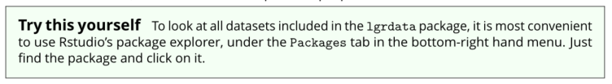
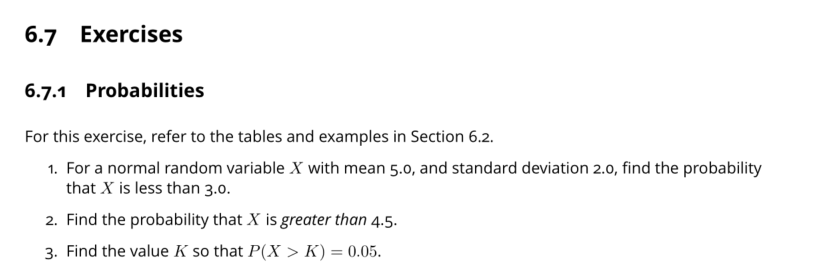

background-image: url(images/classroom.jpg)
class: fitbackground

# Welkom!

---

# Waarom R?

- Flexibiliteit: als je het kunt bedenken, kan het in R
- Veel gebruikers = veel web resources / help
- Makkelijker te leren dan een 'volledige' programmeertaal
- Sterk in visualisatie, rapportage
- Zeer groot aanbod 'packages' (uitbreiding)
- Rstudio: geavanceerd en gratis
- Werkt op Windows/Mac/Linux - zonder aanpassingen
- Gratis!

.center[
  
]

---

background-image: url(images/trainschedule.png)
class: fitbackground

# Rooster

---
# Rooster

.pull-left[
## Dag 1

-  Aan de slag met R en Rstudio
-  Data Skills - Deel 1

## Dag 2

- Data Skills - Deel 2
- Reporting: rmarkdown
- Statistics

## Dag 3

- Programmeren
- Web Services
- Extras

]

.pull-right[

  
]

---

background-image: url(images/shanghairoads.jpg)
class: fitbackground

# Zoek je eigen weg!

---

# De syllabus

- Het gaat om de voorbeelden!

- Probeer zelf voorbeelden aan te passen, en voor inspiratie:
.center[]

- De Exercises zorgen ervoor dat je de belangrijke skills begrijpt:
.center[]

---

# Resources

- Website met links, presentaties: [remkoduursma.github.io/pronexus]()
- E-versie van syllabus: [remkoduursma.github.io/learningguidetor]()

.center[]

